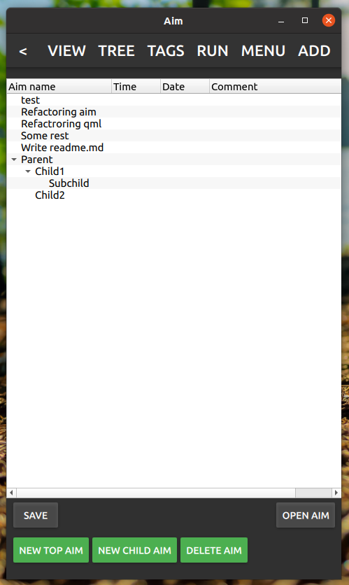
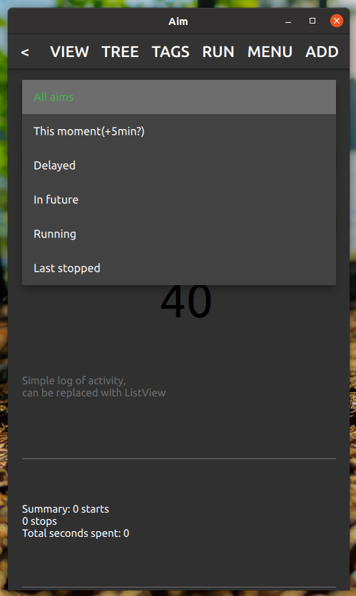

# aim

Pet project from 2017 for learning QML, that grown up into pretty advanced time\task manager.
Base is stored using sqlite.

## Features

* Add new task (aim), it can have: time\date, comments, tree hash tags, priority, parent aim, repeat period
* View or edit single aim, with possibilities: add web links related to aim, navigate through child aims, set current progress, export aim into file (import is also available)
* Track time of running aim (several aims could be running at the same time)
* Navigate through tree of aims (parent\child)
* Navigate through tree of tags (for example #code.refactoring.cpp and #code.refactoring.qml would be grouped)
* Watch and navigate scheduled aims in calendar
* Watch and navigate tracked time on calendar
* Watch tracked time chart for each day using calendar
* Receive notification with popup of upcoming planed aim
* Watch logging in application

Also there was a simple chat using web sockets, but it require additional server, so it was removed.

## Description

Main view:

Contains list of aims, with additional information on each aim.
Fields of aims to display could be configured.
There is search field, that let you search aims by name or tag.

Add new:

Side panel that available from every other view.
Aim must have name, and could have time\date, comments, tags, priority, tags, assignment (to people, dropped with server), parent aim, and repeat period.

Aims tree:

Let you navigate through parent\child aim, and create new aims in tree mode.

Tags tree:

Let you navigate through the tree of tags, to find desired aim.

Run aim:

Let you to start time tracking of an aim.
Aims could be found through different categories:

Schedule:

Let you search planed aims through the calendar.

Done acts:

Let you watch time tracking of aims through the calendar.
Each aim link could be pressed to open single aim view.

Done chart:

Shows activity of day in graphic, can be navigated through calendar.

Single aim view:

Can be opened from any view by double clicking on aim. 
Lets you to edit aim, switch to it children, add links, mark progress and export aim.
Importing aim could be done through menu.

UI is pretty much overloaded, so there is a help button, that shows tool tips, to help a little :)

## Modules to use in your Qt\Qml pet projects

There is set of modules you may find in apptools namespaces, that could be used in Qt\QML projects:

* Clipboard - helps to put text or image of QML component into your OS clipboard
* LogHandler - helps to set levels of logging with custom log handler and also contains QML component to watch logs
* Notification - let you send notification messages
* Popup - draws a popup message on screen, that stays for a limited time on screen, and then disappears, click on it can be handled in you own way
* SystemTray - module to use system tray with menu to hide your application there
* TableSerialize - simple module to serialize table fields into base64 string and back
* TreeModel - model required for using TreeView in QML

